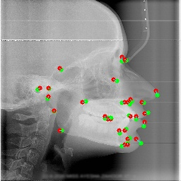

# 자동 두부 계측 랜드마크 탐지 (MRE 4.3px 달성)

이 프로젝트는 Aariz 데이터셋을 사용하여, 자동 두부 계측 랜드마크 탐지 모델을 개발하고 최적화하는 과정을 담고 있습니다. 수많은 실험과 모델 구조 개선을 통해, 최종적으로 테스트셋 기준 **MRE(평균 반경 오차) 4.3px**의 고성능 랜드마크 탐지 모델을 개발하는 데 성공했습니다.

<p align="center">
  
</p>
<p align="center">최종 모델의 예측 결과 시각화 (녹색: 정답, 빨간색: 예측)</p>

---

## 최종 성과

- **모델:** `HeatmapModel` (ResNet-50 백본)
- **최종 성능 (Test Set):** **MRE 4.28 px**
- **최고 성능 모델 파일:** `models/model_heatmap_resnet50_finetuned_mre4.5.pth`

### CVM 분류에 대한 결론

프로젝트의 부가 목표였던 CVM(경추골 성숙도) 단계 분류는, 데이터셋에 CVM 단계를 추론할 수 있는 핵심적인 경추 부위 랜드마크 주석이 존재하지 않아 **현재 데이터셋만으로는 불가능**하다고 최종 결론 내렸습니다. 상세한 실험 과정과 결론은 `memo.txt`에 기록되어 있습니다.

## 사용 가이드

### 1. 환경 설정

프로젝트 실행에 필요한 모든 라이브러리는 `requirements.txt`에 명시되어 있습니다. 다음 명령어로 한 번에 설치할 수 있습니다.

```bash
pip install -r requirements.txt
```

### 2. 성능 평가

저장된 최고 성능 모델(`model_heatmap_resnet50_finetuned_mre4.5.pth`)을 사용하여 테스트 데이터셋에 대한 성능을 직접 확인할 수 있습니다.

```bash
python evaluate.py
```

실행 시, 테스트셋 전체에 대한 최종 MRE 값이 출력됩니다.

### 3. 예측 결과 시각화

모델이 특정 이미지를 어떻게 예측하는지 직접 확인하려면, `--visualize-index` 옵션을 사용하세요. 예를 들어, 테스트셋의 첫 번째 이미지를 시각화하려면 다음 명령어를 실행합니다.

```bash
python evaluate.py --visualize-index 0
```

실행 후, 프로젝트 루트 디렉토리에 `evaluation_visualization.jpg` 파일이 생성됩니다.

### 4. 재훈련 (Optional)

모델을 처음부터 다시 훈련시키거나 추가적인 실험을 진행하고 싶다면, `train.py` 스크립트를 사용하면 됩니다. 훈련에 필요한 주요 설정(학습률, 에포크, 배치 사이즈 등)은 `train.py`와 `config.py` 파일 상단에서 수정할 수 있습니다.

```bash
python train.py
```

## 프로젝트 기록

- **상세 개발 일지:** `memo.txt` 파일에 이 프로젝트의 모든 실험 과정, 문제 해결, 의사 결정 내용이 상세히 기록되어 있습니다.
- **모델 설명서:** `models/model_description.txt` 파일에 지금까지 훈련하고 백업한 모든 모델의 상세한 정보가 기록되어 있습니다.
- **실험용 코드:** `archive/` 폴더에 CVM 분류 실험 등, 현재는 사용하지 않는 과거의 모든 실험용 스크립트가 보관되어 있습니다.

---

*이 README는 원본 `README_original.md`를 기반으로, 실제 프로젝트 진행 내용과 최종 결과물을 반영하여 재작성되었습니다.*
